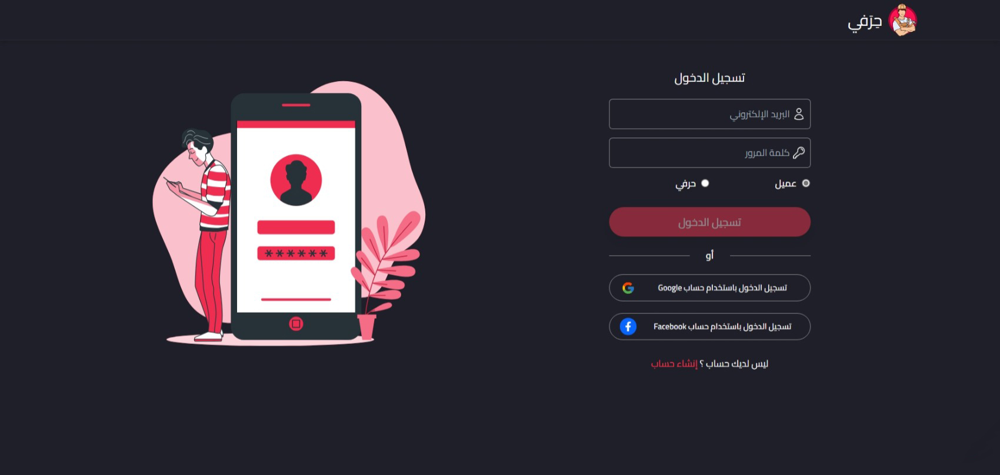
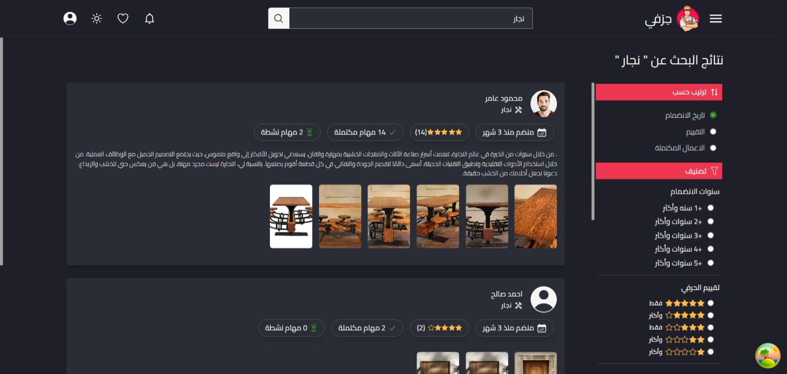
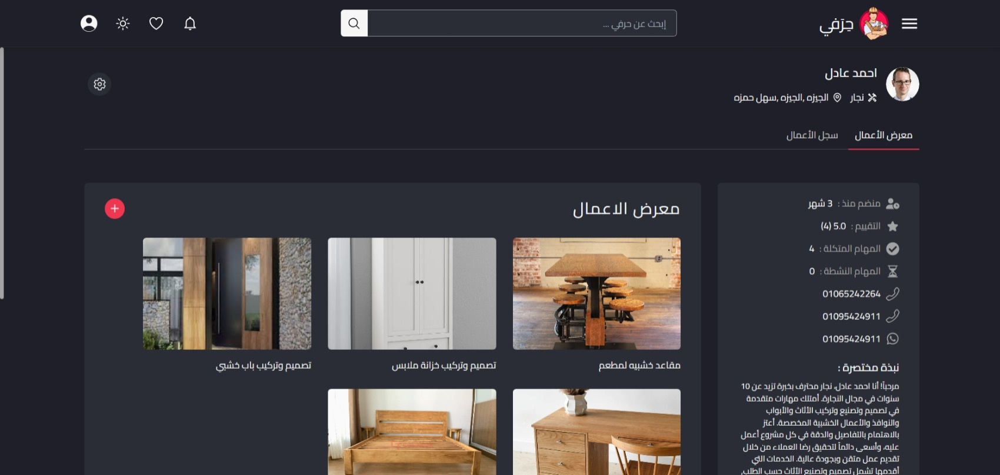
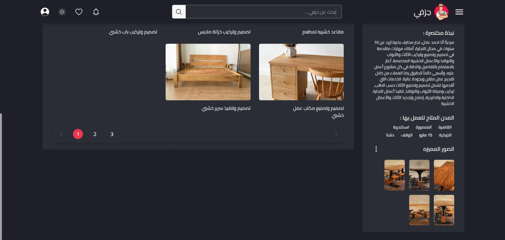
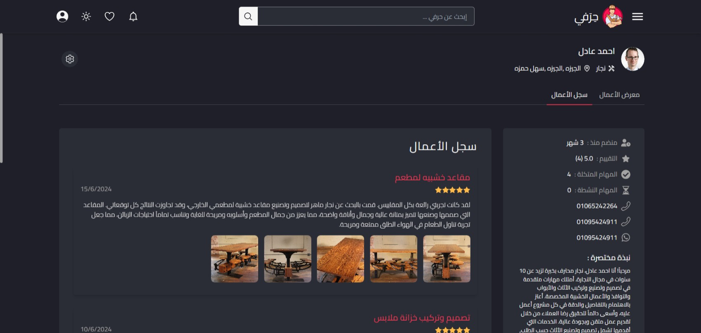
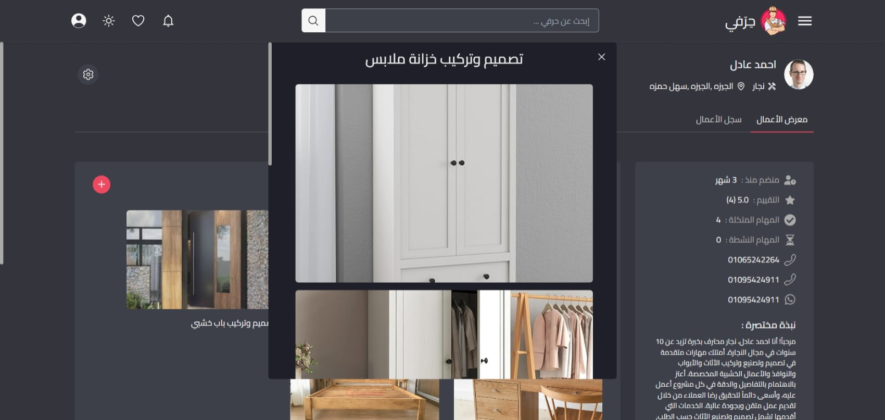
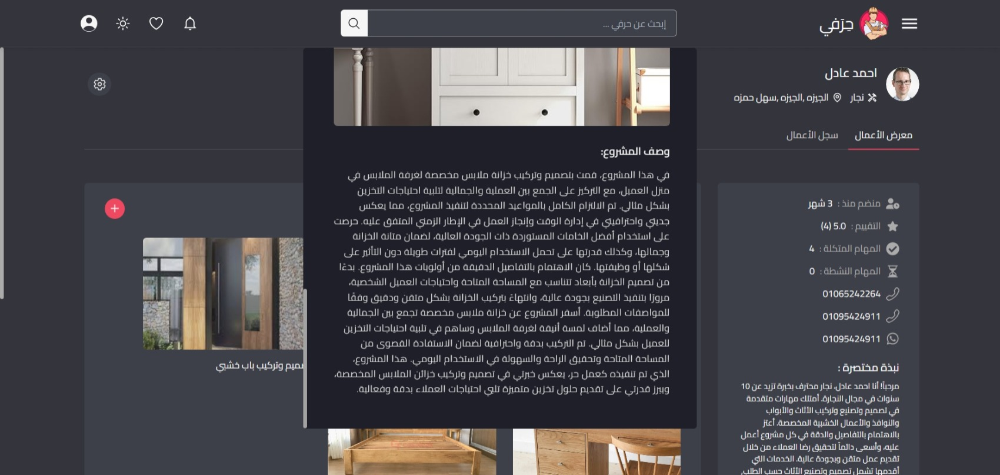
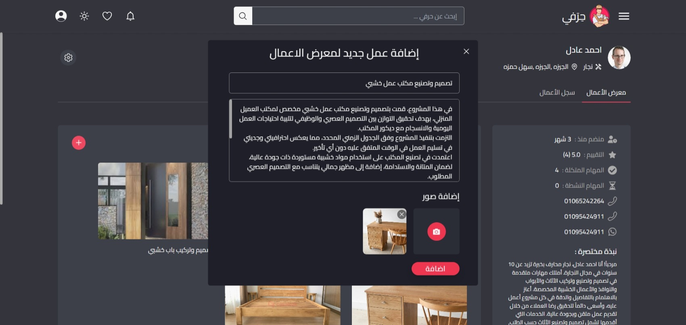

## 🛠️ Hirafi (حِرَفي) — Platform for Clients & Craftsmen

> **⚠️Note:** This project is **not currently hosted online**, as the backend was developed using **Laravel** and temporarily hosted with **nGrok**.
> To understand how it works, check the **walkthrough video** below.

### 📽 Walkthrough Video

[👉 Watch the full walkthrough of the platform here](https://vimeo.com/1106946518)

##  Project Overview

**Hirafi** is a full-stack web application that bridges the gap between clients and skilled craftsmen. In today’s digital world, finding reliable household services can be time-consuming and frustrating. This platform streamlines the process by offering a robust interface for both sides to connect, collaborate, and manage tasks efficiently.

Craftsmen can showcase their portfolio, receive job offers, and maintain their reputation, while clients can easily find, review, and hire craftsmen based on skills, location, and ratings.

##  Features

### Authentication

* Sign up and login with role selection (Client or Craftsman)
* Forgot password recovery
* Social login (Google & Facebook)

### Handymen Complete Data After Signup

  
  
  
  

###  Client Pages

1. **Add Job Offer (Multi-Step Form)**

   * Step 1: Enter title, description, select skill category, and upload images
   * Step 2: Choose start date or a date range
   * Step 3: Add address and expected budget
   * Step 4: Review and confirm submission
  

  
  
  
  

2. **My Job Offers**

   * View offers submitted by the client that are still awaiting a craftsman assignment
  

  

3. **Job Offer Detail**

   * View job details and see proposals from craftsmen
   * Accept one of the proposals to assign the task
  

  
  

4. **Active Jobs**

   * Jobs currently in progress with assigned craftsmen
  

  

5. **Active Job Detail**

   * Full job details
   * Button to “End Job” which opens a modal for submitting craftsman review
  

  
  

6. **Favorites**

   * Create and manage favorite lists of craftsmen for easy access later
  

  
  
  
  

7. **Search Craftsmen**

   * Search by craft type
   * Sort by: Join date, rating, completed jobs
   * Filter by: Years of experience, rating, or city

  

  

### Craftsman Pages

1. **New Jobs**

   * See job listings that match their skill and city
  

  
  

2. **New Job Details**

   * View full job description
   * Submit offer via modal window
  

  
  

3. **Pending Jobs**

   * Jobs they have applied to, but not yet accepted
  

  

4. **Pending Job Details**

   * View submitted offer and status
  

  

5. **Active Jobs**

   * Jobs currently in progress

  

6. **Active Job Detail**

   * Full job info
   * Button to “End Job” opens modal to rate the client

  
  

7. **Craftsman Portfolio**

   * Displays:

     * Work locations
     * Completed jobs count
     * Active jobs
     * Contact info
     * Featured photos (shown in search)
     * Portfolio gallery of previous projects
     * Client feedback from past jobs

  

  
  
  
  
  
  

## Problem Addressed

### For Clients:

* Hard to find trusted, skilled craftsmen
* Unclear quality and pricing
* Poor communication and job misalignment

### For Craftsmen:

* Inconsistent visibility and job flow
* No centralized place to display their work
* Struggles with pricing and negotiation
* Lack of transparent client feedback

##  Project Objectives

* Bridge the gap between clients and craftsmen
* Build trust through reviews, ratings, and portfolios
* Empower craftsmen to promote their skills and services
* Create more stable job opportunities for skilled workers
* Offer clients reliable, filtered access to local professionals

## Tech Stack

### Frontend

* **React** + **Vite**
* **TailwindCSS** for styling
* **React Router DOM** for routing
* **Framer Motion** for animations
* **React Hook Form** for forms
* **React Query** for data caching and async state
* **Recharts** for data visualizations

### Authentication & Social Login

* Google OAuth (`@react-oauth/google`)
* Facebook login (`@greatsumini/react-facebook-login`)

### Utilities

* Axios (API calls)
* JWT Decode
* Date-fns (date handling)
* Pusher.js (realtime interactions)
* React Toastify

### Dev Tools

* ESLint & Prettier (code formatting and linting)
* PostCSS & Tailwind Prettier plugin

> ⚠️ Backend is not included — it was built using **Laravel** and hosted locally via **nGrok** for testing purposes.
